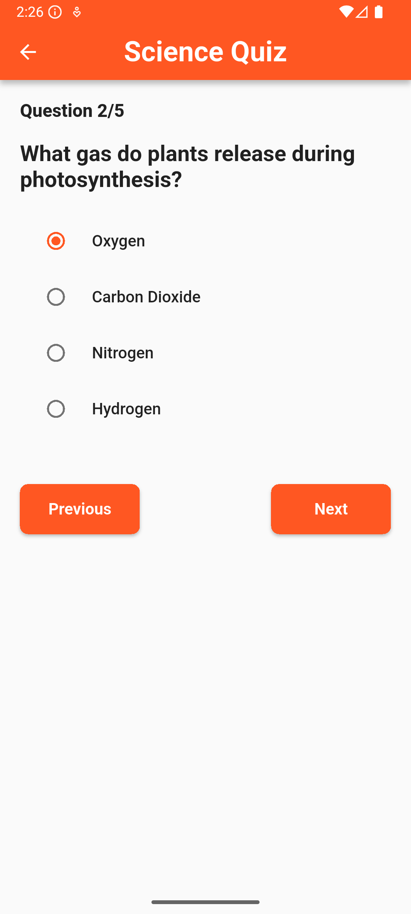
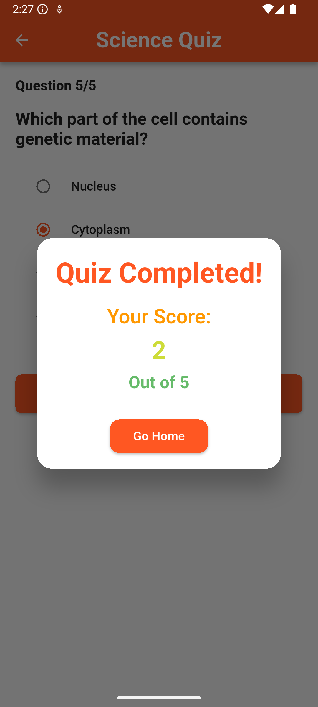

# Quiz0 🎯

A Flutter quiz application designed to make learning fun and interactive.

## Features
- Onboarding screen for new users
- Category selection on the home screen
- Interactive quiz questions with multiple-choice answers
- Real-time score tracking and scoreboard

## Screenshots

### Onboarding Screen (Landscape)


### Portrait Screens (Home, Quiz, Scoreboard)
<div style="display: flex; gap: 10px; justify-content: center; flex-wrap: wrap;">
  
  
  
</div>

## Getting Started

This project is a starting point for a Flutter application.

### Prerequisites
- [Flutter SDK](https://docs.flutter.dev/get-started/install)
- IDE (VS Code, Android Studio, or IntelliJ)

### Clone the repository
```bash
git clone https://github.com/your-username/quiz0.git
